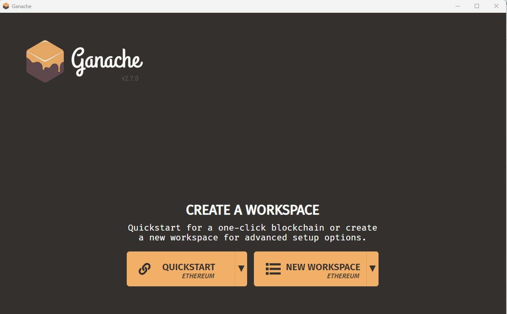
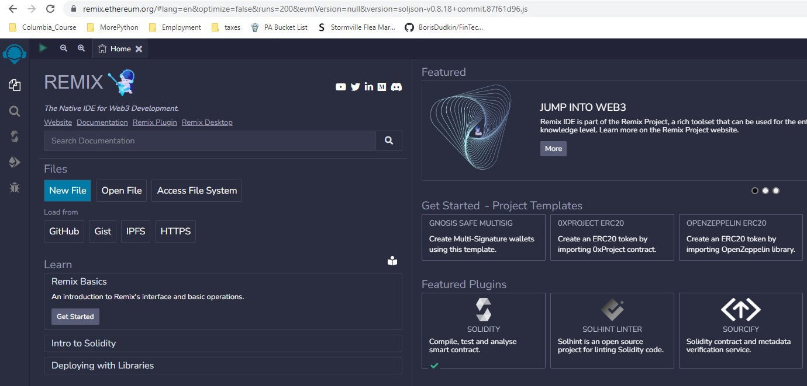
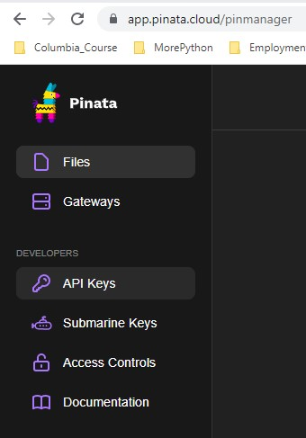

# FinTech Project 3 
# Digital Art

This application offers digital art creators a one-step full solution from minting and registering their digital art to putting the art pieces on the auction.</br>
The simple user friendly interface of the applcation allows a user to first mint and register his/her art piece. Once the NFT is minted and registered, we utilize Pinata services to store the newly created contracts in a decentralized manner. </br>
After minting and registering their art, the creator can right away put it on the decentralized marketplace. The auction runs for a certain time period within which the bidders can place their bids and, where the highest bid and the highest bidder are identified after each bid. The bid withdrawl is also available to the bidders who are not identified as the highest bidder. The withdrawl is open during as well as some additional time after the auction's closing.</br>
Once the auction has ended, the NFT will have changed the ownership and be transferred to the highest bidder, if any, while the highest bid will have been transferred to the seller.

---

---

## Table of contents

1. [Technologies](#technologies)
2. [Installation Guide](#installation-guide)
3. [Usage](#usage)
4. [Contributors](#contributors)
5. [License](#license)

---

## Technologies
```
Python 3.9
Solidity
Remix IDE
Ganache
Pinata IPFS Storage
```

Python libraries:

1. `Pandas` is a Python package that provides fast, flexible, and expressive data structures designed to make working with large sets of data easy and intuitive.

   - [pandas](https://github.com/pandas-dev/pandas) - for the documentation, installation guide and dependencies.

2. `Streamlit` is a library that allows developers to build web applications with live user input.

   - [Streamlit](https://streamlit.io/) - to read more about deploying, installing and customizing.<br/>

3. 2. `Streamlit-lottie` A Streamlit custom component to load Lottie animations

   - [Streamlit-lottie](https://pypi.org/project/streamlit-lottie/) - to read more about deploying, installing and customizing.<br/>

3. `NumPy` is an open source library that adds computational tools to a project, including mathematical functions and random number generators.

   - [Numpy](https://numpy.org/) - to read about available functions and installation.<br/>

4. `web3` is a Python library for interacting with Ethereum

    - [web3](https://pypi.org/project/web3/) - to read about available functions and installation.<br/>
    
5. `math` library provides access to the mathematical functions defined by the C standard.

    - [math](https://docs.python.org/3/library/math.html) - to read about available functions and installation.<br/>

6. `attributedict` is library that allows you to access dictionary keys as if they were object attributes. 

    -[attributedict](https://pypi.org/project/attributedict/) - to read about available functions and installation.<br/>


6. Python modules and libraries to interface with websites and smart contracts:

- Requests: With the requests library, you can easily send HTTP requests to web servers and APIs. 

- JSON: JSON is used to specify the interface for smart contracts. This interface is defined using the Application Binary Interface (ABI) format, which is a standardized way of defining the methods and data types that a smart contract exposes to other contracts or external clients.

  The Requests and JSON libraries get installed with Anaconda. To verify, in Terminal type:

---

## Installation Guide

The application can be started from the terminal using Streamlit, once in the directory of the application and all the required libraries and the application are installed.  (see instructions below):<br/>

```python
streamlit run app.py
```


### Library Installations

Install each of the below libraries:<br/>

To install pandas run:

```python
pip install pandas
```

```python
# or conda
conda install pandas
```
To install Streamlit, in Terminal run:

```python
pip install streamlit
```

Confirm the installation of the Streamlit package by running the following commands in Terminal:

```python
 conda list streamlit
```

To install Streamlit Lottie in Terminal run:

```python
pip install streamlit-lottie
```

Confirm the installation of the Streamlit-lottie package by running the following commands in Terminal:

```python
 conda list streamlit-lottie
```
To install AttributeDict in Terminal run:

```python
pip install attributedict
```
Confirm the installation of the AttributeDict package by running the following commands in Terminal:

```python
 conda list attributedict
```


If Requests and JSON libraries are missing, in Terminal run:

```python
conda install -c anaconda requests
conda install -c jmcmurray json
```

### Software Installation
Once all the libraries are installed please Install following software:

#### Ganache
Ganache is a program that allows you to set up a local blockchain, which you can be used to test and develop smart contracts.
1. download the latest version of Ganache and then create a Ganache workspace throught this link [Ganache download page](https://trufflesuite.com/ganache/)
2.  Once installed please open Ganache and create a workspace by clicking Quickstart Ethereum. 

3. Open Sample.env file in the cloned folder and use the RPC SERVER address from Ganache as input for the WEB3_PROVIDER_URI address in the Sample.env file and save Sample.env file. 

### Web Services

#### Remix IDE
Remix IDE is used to build and test smart contracts created in Solidity. For this project the web version of [REMIX IDE](https://remix.ethereum.org/) can be used
1. Open Remix IDE by clicking the link
2. Select solidity in the featured plugins area


#### Pinata
Storing data on a chain is expensive. IPFS is a technology that can be used to store and retrieve files from a decentralized system. IPFS distributes each file across multiple nodes in its own network. It breaks down the file into pieces of data and then distributes the pieces across multiple nodes. Smart contracts and dApps can store and retrieve their files directly from the nodes that have the data pieces. This means that they store and access their data by using a decentralized technology—without the expense of storing that data on the chain.
For this dApp Pinata is utilized for IPFS services. 

1. Go to Pinata website [Pinata Website](https://www.pinata.cloud/)
2. Sign up for a free account.
3. Log into the pinata dashboard. 
4. Select API keys 

5. Open Sample.env file in the cloned folder and input the Pinata API KEY and SECRET API KEY in the file and save Sample.env file. 


Copy the provided SAMPLE.env file to a new file named .env, and then add the missing data to the environment variables.

## Contributors

Contact Details:

Boris Dudkin:
- [Email](boris.dudkin@gmail.com)
- [LinkedIn](www.linkedin.com/in/Boris-Dudkin)

Niels de Haan:
- [Email](nlsdhn@gmail.com)
- [LinkedIn](www.linkedin.com/in/nielsdehaan)
---

## License

MIT

---