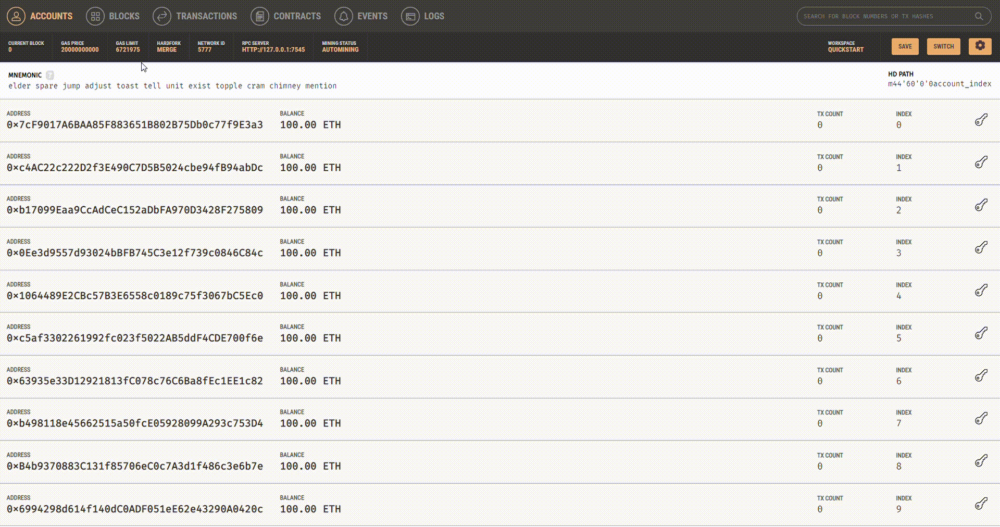

# FinTech Project 3 
# Digital Art

This application offers digital art creators a one-step full solution from minting and registering their digital art to putting the art pieces on the auction.</br>
The simple user friendly interface of the applcation allows a user to first mint and register his/her art piece. Once the NFT is minted and registered, we utilize Pinata services to store the newly created contracts in a decentralized manner. </br>
After minting and registering their art, the creator can right away put it on the decentralized marketplace. The auction runs for a certain time period within which the bidders can place their bids and, where the highest bid and the highest bidder are identified after each bid. The bid withdrawl is also available to the bidders who are not identified as the highest bidder. The withdrawl is open during as well as some additional time after the auction's closing.</br>
Once the auction has ended, the NFT will have changed the ownership and be transferred to the highest bidder, if any, while the highest bid will have been transferred to the seller.

---

---

## Table of contents

1. [Technologies](#technologies)
2. [Installation Guide](#installation-guide)
3. [Usage](#usage)
4. [Contributors](#contributors)
5. [License](#license)

---

## Technologies
```
Python 3.9
Solidity
Remix IDE
Ganache
Pinata IPFS Storage
```

Python libraries:

1. `Pandas` is a Python package that provides fast, flexible, and expressive data structures designed to make working with large sets of data easy and intuitive.

   - [pandas](https://github.com/pandas-dev/pandas) - for the documentation, installation guide and dependencies.

2. `Streamlit` is a library that allows developers to build web applications with live user input.

   - [Streamlit](https://streamlit.io/) - to read more about deploying, installing and customizing.<br/>

3. `Streamlit-lottie` A Streamlit custom component to load Lottie animations

   - [Streamlit-lottie](https://pypi.org/project/streamlit-lottie/) - to read more about deploying, installing and customizing.<br/>

4. `dotenv` Python-dotenv reads key-value pairs from a .env file and can set them as environment variables. 

   - [dotenv](https://pypi.org/project/python-dotenv/) - to read about available functions and installation.<br/>

5. `web3` is a Python library for interacting with Ethereum

   - [web3](https://pypi.org/project/web3/) - to read about available functions and installation.<br/>
    
6. `attributedict` is library that allows you to access dictionary keys as if they were object attributes. 

   - [attributedict](https://pypi.org/project/attributedict/) - to read about available functions and installation.<br/>

7. `requests` with the requests library, you can easily send HTTP requests to web servers and APIs. 

   - [requests](https://pypi.org/project/requests/) - to read about available functions and installation.<br/>

8. `JSON` the json library is used to encode and decode data in JSON (JavaScript Object Notation) format. 

   - [JSON](https://docs.python.org/3/library/json.html) - to read about available functions and installation.<br/>

9. `math` library provides access to the mathematical functions defined by the C standard.

   - [math](https://docs.python.org/3/library/math.html) - to read about available functions and installation.<br/>

10. `pathlib` This module offers classes representing filesystem paths with semantics appropriate for different operating systems.

      - [pathlib](https://docs.python.org/3/library/pathlib.html) - to read about available functions and installation.<br/>

---

The requests, JSON, math and pathlib libraries come installed with Anaconda. To verify, in Terminal type:

```python
conda list | grep -E 'requests|json|math|pathlib'
```
---

## Installation Guide

The application can be started from the terminal using Streamlit, once in the directory of the application and all the required libraries and the application are installed.  (see instructions below):<br/>

```python
streamlit run app.py
```
### Library Installations

Install each of the following libraries (if not installed already):<br/>

To install pandas run:

```python
pip install pandas
```
Confirm the installation of pandas package by running the following commands in Terminal:
```python
conda list pandas
```

To install Streamlit, in Terminal run:

```python
pip install streamlit
```
Confirm the installation of the Streamlit package by running the following commands in Terminal:

```python
 conda list streamlit
```

To install Streamlit Lottie in Terminal run:

```python
pip install streamlit-lottie
```
Confirm the installation of the Streamlit-lottie package by running the following commands in Terminal:

```python
 conda list streamlit-lottie
```

To install dotenv in Terminal run:

```python
pip install python-dotenv
```
Confirm the installation of the dotenv package by running the following commands in Terminal:

```python
 conda list python-dotenv
```

To install web3 in Terminal run:

```python
pip install web3
```
Confirm the installation of the web3 package by running the following commands in Terminal:

```python
 conda list web3
```

To install attributedict in Terminal run:

```python
pip install attributedict
```
Confirm the installation of the math package by running the following commands in Terminal:

```python
 conda list attributedict
```

If Requests, JSON, math or Pathlib libraries are missing, in Terminal run:

```python
conda install -c anaconda requests
conda install -c jmcmurray json
conda install math
conda install pathlib
```

### Software Installation
Once all the libraries are installed please Install following software:

#### **Ganache**
Ganache is a program that allows you to set up a local blockchain, which you can be used to test and develop smart contracts.
1. Download the latest version of Ganache and then create a Ganache workspace throught this link [Ganache download page](https://trufflesuite.com/ganache/)
2. Once installed please open Ganache and create a workspace by clicking Quickstart Ethereum. 
3. Open **Sample.env** file in the cloned folder and use the **RPC SERVER** address from Ganache as input for the **WEB3_PROVIDER_URI** address in the Sample.env file and save Sample.env file. 


### **Web Services**

#### **Remix IDE**
Remix IDE is used to build and test smart contracts created in Solidity. For this project the web version of Remix IDE can be used. 
1. Open Remix IDE by clicking the following link [REMIX IDE](https://remix.ethereum.org/)
2. Select solidity in the featured plugins area


#### **Pinata**
Storing data on a chain is expensive. IPFS is a technology that can be used to store and retrieve files from a decentralized system. IPFS distributes each file across multiple nodes in its own network. It breaks down the file into pieces of data and then distributes the pieces across multiple nodes. Smart contracts and dApps can store and retrieve their files directly from the nodes that have the data pieces. This means that they store and access their data by using a decentralized technology—without the expense of storing that data on the chain.
For this dApp Pinata is utilized for IPFS services. 

1. Go to Pinata website [Pinata Website](https://www.pinata.cloud/)
2. Sign up for a free account.
3. Log into the pinata and proceed to the dashboard. 
4. In the developers section please select API keys or access through the following link [Pinata API Keys](https://app.pinata.cloud/developers/api-keys)
5. Please click on + New Key
6. Make sure to click the option to grant Admin privileges for your keys.
7. Please insert a Key Name
8. Click Create Key button
9. Open **Sample.env** file in the cloned folder and copy the Pinata **API KEY** and **SECRET KEY** into the Sample.env file and save Sample.env file. 


---

## Usage

After the installation of all required libraries, software, established access to both web services and updated the **PINATA_API_KEY**, **PINATA_SECRET_API_KEY** with the API information from Pinata and the **WEB3_PROVIDER_URI** with the RPC Server information from GANACHE in the Sample.env file you are ready setup the environment to run the streamlit app.py application.

Please follow the following steps in the exact sequence described below:

#### Step 1: Ganache
Create a new Ganache workspace
* click Quickstart Ethereum, or if already in a started session click switch button this will bring you back to the starting screen. (Please also see video below)
* Please make sure that the RPC Server Address is the same as the WEB3_PROVIDER_URI in the Sample.env file



#### Step 2: Remix IDE Setup
* Start Remix IDE [REMIX IDE](https://remix.ethereum.org/)
* Select File Explorer
* Create new WorkSpaces and Provide Workspace Name
* Select Upload Folder
* Select contracts folder within the project folder
* Auction_deployer.sol and NFTRegister_2.sol are now availabele within Remix IDE


#### Step 3: Compile and Deploy AuctionDeployer Smart Contract in Remix IDE
* Select Auction_deployer.sol contract (by clicking on the contract a new tab will open in remix displaying to solidity code)
* Select Solidity Compiler Icon (Left sidebar)
* Select Pragma Solidity Compiler in COMPILER selextbox (In this project you can use the 0.8.6 and up)
* Select Compile Auction_Deployer.sol (Please wait until check mark appears)
* Select Deploy and Run Transactions icon (left sidebar)
* Select Dev - Ganache Provider in ENVIRONMENT selectbox
* In the Pop-up please provide the correct RPC Server Address
* Select AuctionDeployer in CONTRACT (compile by Remix) selectbox
* Select Deploy -- Auction Deployer Contract should appear in Deployed Contracts Section


#### Step 4: Deploy Auction Contract and NFT Register Contract (from auction deployer contract)
* In Auction Deployer contract click button Auction_address
* Copy auction address by couble clicking on the address, use right mouse click and copy address.
* Select Auction contract in CONTRACT (compile by Remix) selectbox
* Paste auction address in "At Address" text box and 
* Click "At Address" Button
* Copy NFTRegistry address by couble clicking on the address, use right mouse click and copy address.
* Select NFTRegistry contract in CONTRACT (compile by Remix) selectbox
* Paste NFTRegistry address in "At Address" text box and 
* Click "At Address" Button
* Both Contracts should now be availabe in the Deployed Contracts Section. 


## Contributors

Contact Details:

Boris Dudkin:
- [Email](boris.dudkin@gmail.com)
- [LinkedIn](www.linkedin.com/in/Boris-Dudkin)

Niels de Haan:
- [Email](nlsdhn@gmail.com)
- [LinkedIn](www.linkedin.com/in/nielsdehaan)
---

## License

MIT

---